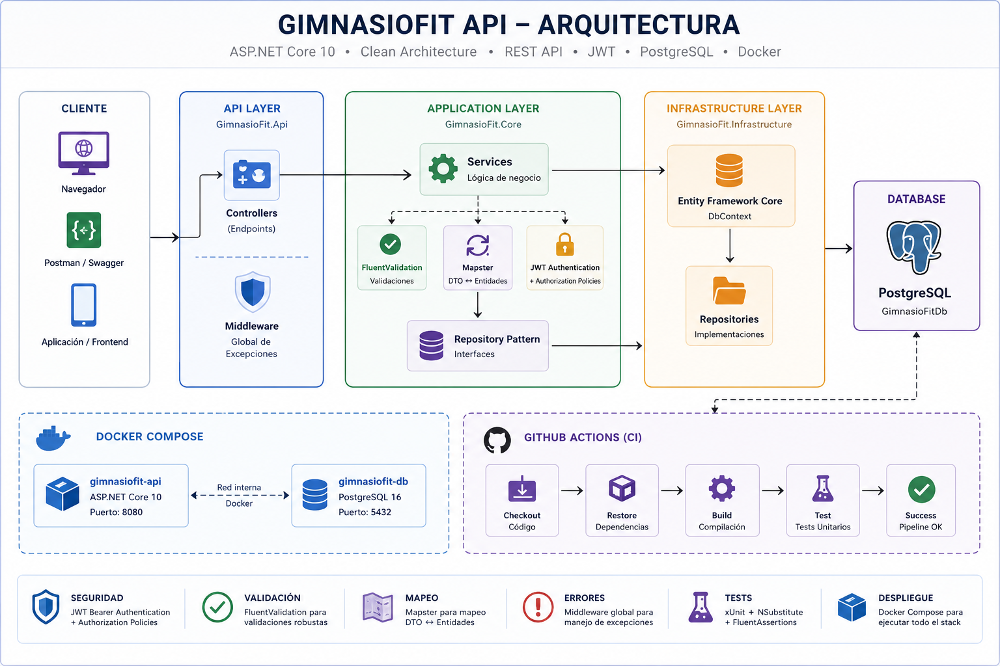
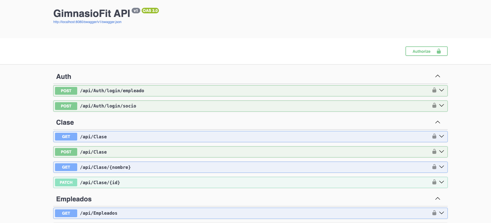
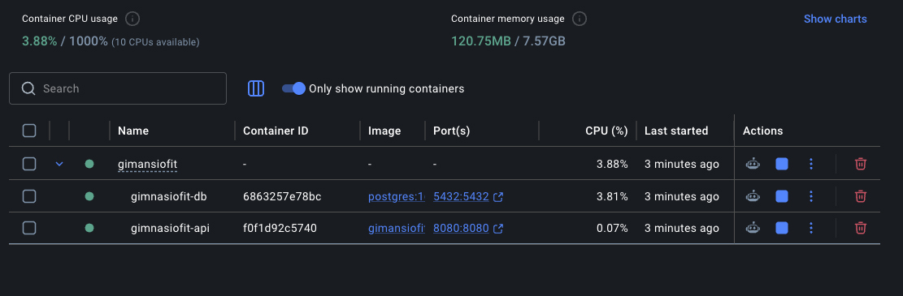
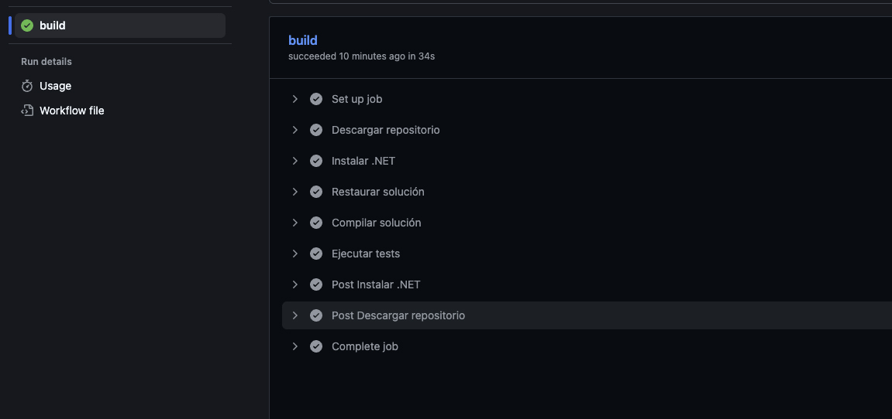

# GimnasioFit API

> API REST desarrollada con **ASP.NET Core 10** para la gestión integral de un gimnasio.

Este proyecto ha sido desarrollado con el objetivo de construir una aplicación lo más cercana posible a un entorno profesional, aplicando principios de arquitectura limpia, separación de responsabilidades, buenas prácticas de desarrollo y herramientas habituales del ecosistema .NET.

Incluye autenticación JWT, documentación interactiva con Swagger, PostgreSQL, Docker, pruebas unitarias e integración continua mediante GitHub Actions.

---

# Características principales

- Arquitectura por capas (API / Core / Infrastructure)
- Repository Pattern
- Service Layer
- Entity Framework Core
- PostgreSQL
- Docker + Docker Compose
- Autenticación JWT
- Autorización mediante Policies
- Swagger con autenticación JWT
- Middleware global para gestión de excepciones
- FluentValidation
- Mapster
- Inyección de dependencias
- Tests unitarios con xUnit, NSubstitute y FluentAssertions
- Integración continua mediante GitHub Actions

---

# Arquitectura del proyecto


La solución está dividida en diferentes proyectos para mantener una clara separación de responsabilidades.

```
GimnasioFit
│
├── GimnasioFit.Api
│   ├── Controllers
│   ├── Config
│   ├── Middlewares
│   └── Validators
│
├── GimnasioFit.Core
│   ├── Models
│   ├── DTOs
│   ├── Interfaces
│   ├── Repositories
│   ├── Services
│   └── Common
│
├── GimnasioFit.Infrastructure
│   ├── Data
│   ├── Repositories
│   └── Services
│
└── GimnasioFit.Tests
```

Cada capa tiene una responsabilidad específica:

- **API**: expone los endpoints HTTP y configura la aplicación.
- **Core**: contiene el dominio, contratos, DTOs e interfaces.
- **Infrastructure**: implementa el acceso a datos y la lógica de negocio.
- **Tests**: valida el comportamiento de los servicios mediante pruebas unitarias.

---

# Tecnologías utilizadas

| Tecnología | Uso |
|------------|-----|
| ASP.NET Core 10 | API REST |
| Entity Framework Core | Acceso a datos |
| PostgreSQL | Base de datos |
| Docker | Contenerización |
| Docker Compose | Orquestación |
| JWT | Autenticación |
| Swagger | Documentación interactiva |
| FluentValidation | Validación |
| Mapster | Mapeo entre entidades y DTOs |
| xUnit | Tests |
| NSubstitute | Mocking |
| FluentAssertions | Aserciones |
| GitHub Actions | Integración continua |

---

# Flujo interno



Todas las peticiones siguen el siguiente recorrido:

```
Cliente

↓

Controller

↓

Service

↓

Repository

↓

Entity Framework Core

↓

PostgreSQL
```

Los **Controllers** únicamente reciben la petición HTTP y devuelven la respuesta correspondiente.

Toda la lógica de negocio reside en la capa **Service**, mientras que el acceso a datos queda completamente encapsulado dentro de los **Repositories**.

Este diseño facilita el mantenimiento, las pruebas unitarias y la escalabilidad del proyecto.

---

# Gestión de errores

La aplicación implementa un **Middleware global de excepciones**.

Cualquier excepción no controlada es interceptada y convertida en una respuesta HTTP uniforme, evitando exponer información interna del servidor.

---

# Validación

La validación de los modelos se realiza mediante **FluentValidation**.

Esto permite mantener los controladores limpios y separar completamente las reglas de validación de la lógica de negocio.

---

# Autenticación y autorización

La autenticación se realiza mediante **JSON Web Tokens (JWT)**.

La API implementa políticas de autorización basadas en niveles de acceso.

Swagger permite autenticarse directamente mediante el botón **Authorize**, facilitando las pruebas de los endpoints protegidos sin necesidad de herramientas externas.

---

# Base de datos

La aplicación utiliza **PostgreSQL** como sistema gestor de base de datos.

Toda la persistencia está implementada mediante **Entity Framework Core**.

---

# Ejecución mediante Docker

## Requisitos

- Docker Desktop

---

## Clonar el repositorio

```bash
git clone https://github.com/Samisuke/GimnasioFit.git
```

Entrar en la carpeta del proyecto:

```bash
cd GimnasioFit
```

---

## Iniciar la aplicación

Desde la raíz del proyecto ejecutar:

```bash
docker compose up --build -d
```

Este comando realiza automáticamente:

- Construcción de la imagen de la API.
- Descarga de la imagen oficial de PostgreSQL.
- Creación de la base de datos.
- Creación de la red interna entre contenedores.
- Inicio de ambos servicios.

---

## Acceder a Swagger

Una vez iniciada la aplicación:

```
http://localhost:8080/swagger
```

Desde Swagger es posible probar todos los endpoints y autenticarse mediante JWT utilizando el botón **Authorize**.

---

# Capturas

## Swagger

Documentación automática y autenticación mediante JWT.



---

## Docker

API y PostgreSQL ejecutándose mediante Docker Compose.



---

# Integración continua

El proyecto incorpora un flujo de integración continua mediante **GitHub Actions**.

Cada vez que se realiza un **Push** o un **Pull Request**, GitHub ejecuta automáticamente:

- Restauración de dependencias.
- Compilación completa de la solución.
- Ejecución de todos los tests unitarios.

Esto garantiza que el proyecto permanece compilable y que los cambios no rompen el comportamiento existente.



---

# Autor

Desarrollado por **Samuel** como proyecto de portfolio para demostrar conocimientos en desarrollo backend con **ASP.NET Core**, aplicando prácticas habituales en proyectos profesionales como arquitectura por capas, pruebas automatizadas, Docker e integración continua.
